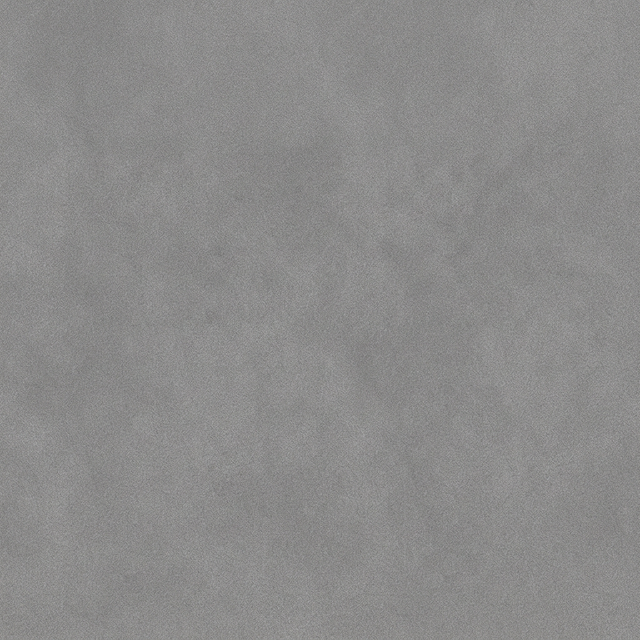
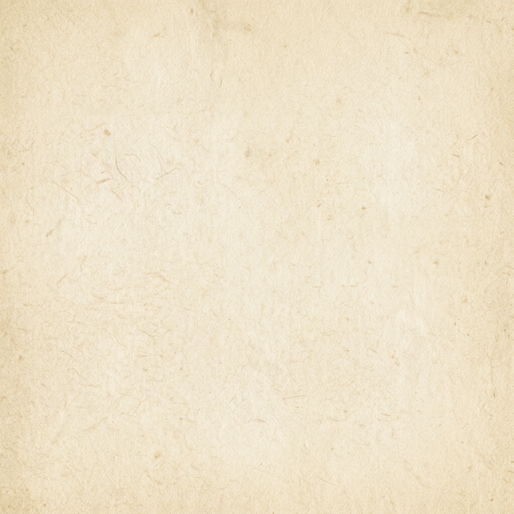

<div align="center">

# 🎭 Muhammed Shadil MP | Cinematic Portfolio

**A story of design & code.**  
*Crafting visually engaging digital products with strong motion design, thoughtful user experiences, and clean frontend architecture.*

[Live Preview](#) <!-- Add deployment URL here later -->

[](https://nextjs.org/)
[](https://www.typescriptlang.org/)
[](https://tailwindcss.com/)
[](https://www.framer.com/motion/)
[](https://greensock.com/gsap/)

<br/>

</div>

<br/>

## ✦ The Aesthetic

This portfolio is built with a **cinematic documentary style**, designed to feel like a high-end editorial piece. 

It features:
- **Textured Paper Aesthetic:** Complex custom CSS properties with vintage paper overlays and noise backgrounds mimicking analog print.
- **Film Grain Overlays:** A constantly animating, subtle grain giving a timeless cinematic feel.
- **Scroll Storytelling:** Sequential text reveals powered by GSAP ScrollTrigger to tell a narrative as you navigate.
- **Parallax Movement:** Layered scroll speeds to add physical depth to flat scenes.
- **Smooth Scrolling:** Lenis scroll hijacking ensures the animations trigger identically across all environments.

---

## ⟨/⟩ Tech Stack

- **Framework:** Next.js 14 (App Router)
- **Language:** TypeScript
- **Styling:** Tailwind CSS (Custom color theme: *Paper & Ink*)
- **Animations:** Framer Motion (Variants, Staggers, WhileInView)
- **Advanced Scroll Effects:** GSAP + ScrollTrigger
- **Scroll Hijacking:** Lenis (@studio-freight/lenis)
- **Typography:** Google Fonts (Outfit, Playfair Display, JetBrains Mono)

---

## ◈ Project Structure

```bash
├── public/                 # Static Assets
│   ├── images/             # Project Previews & Profile 
│   └── textures/           # Film Grain, Paper & Noise overlays
├── src/
│   ├── app/
│   │   ├── globals.css     # Global film grain, paper card styling, & keyframes
│   │   ├── layout.tsx      # Font config & Root provider
│   │   └── page.tsx        # Central composition of all sections
│   ├── components/         # Modular cinematic sections
│   │   ├── SmoothScroll.tsx
│   │   ├── Navbar.tsx
│   │   ├── Hero.tsx
│   │   ├── AboutSection.tsx
│   │   ├── MapSection.tsx
│   │   ├── SkillsSection.tsx
│   │   ├── Projects.tsx
│   │   ├── ExperienceSection.tsx
│   │   └── ContactSection.tsx
│   └── lib/
│       └── animations.ts   # Reusable Framer Motion Variants
```

---

## ⚙ Getting Started

To run this beautifully animated project locally:

1. **Clone the repository**
   ```bash
   git clone https://github.com/mhmmdshadil/portfolio-website.git
   cd portfolio-website
   ```

2. **Install dependencies**
   ```bash
   npm install
   ```

3. **Start the development server**
   ```bash
   npm run dev
   ```

4. Open [http://localhost:3000](http://localhost:3000) with your browser to see the result.

---

## ✎ About The Creator

**Muhammed Shadil MP** is a UI/UX Designer and Frontend Developer from Kerala, India. 
Every project taken on is an opportunity to merge creativity with precision, crafting interfaces that feel alive and intuitive.

*Every pixel tells a story. Every interaction has a purpose.*

<br/>

<div align="center">
  
  <br/>
  <p><i>Lets build something beautiful together.</i></p>
  <p>
    <a href="mailto:muhammedshadilmp7@gmail.com">Email</a> •
    <a href="https://github.com/mhmmdshadil">GitHub</a> •
    <a href="https://www.linkedin.com/in/mhmmdshadil/">LinkedIn</a> •
    <a href="https://www.instagram.com/mhmmd.shadil/">Instagram</a>
  </p>
</div>
